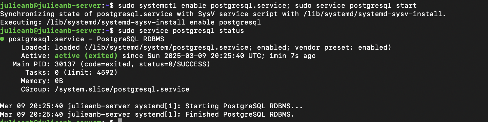
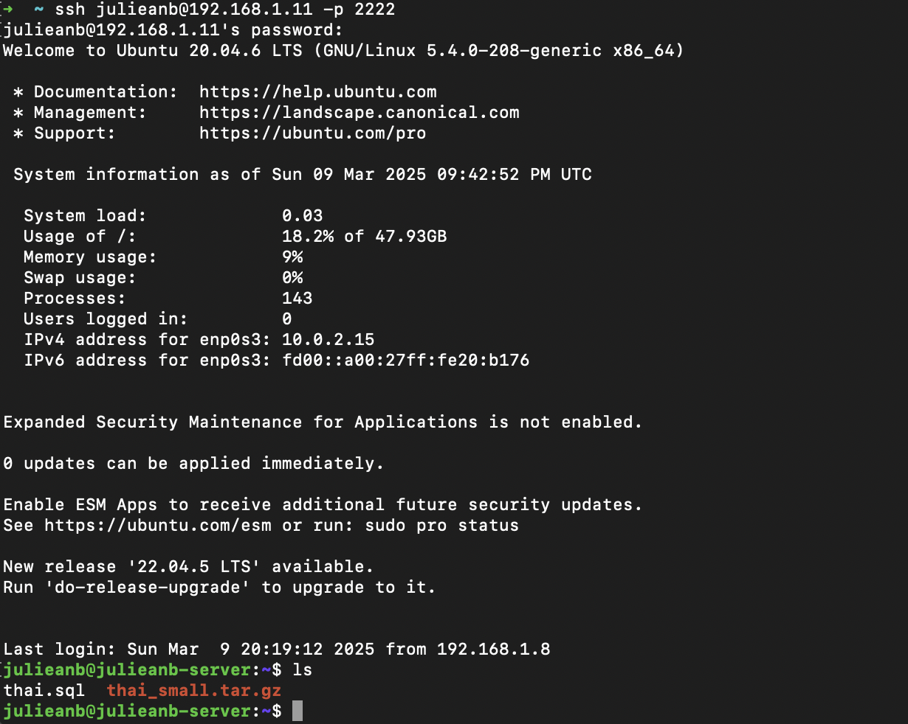
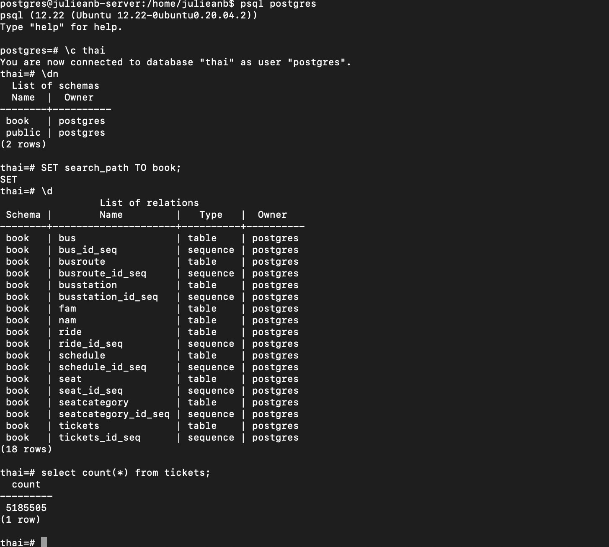

#### ВМ с ubuntu 20.04 была установлена на машину 1, работа велась через машину 2 по локальной сети для имитации работы в облаке
#### Ресуры: 2 cpu, 4gb ram, 100gb disk
#### Установка PostgreSQL 12.22:

#### Скачивание данных:

#### Считаем количество тикетов:
