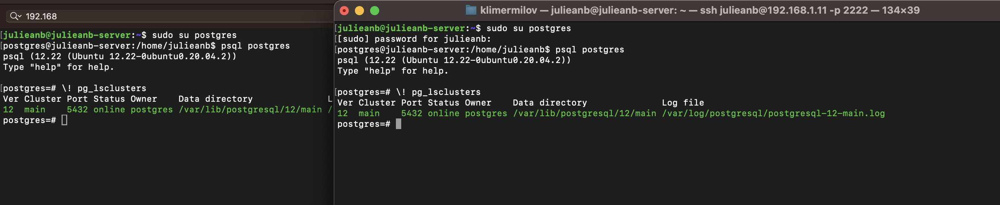
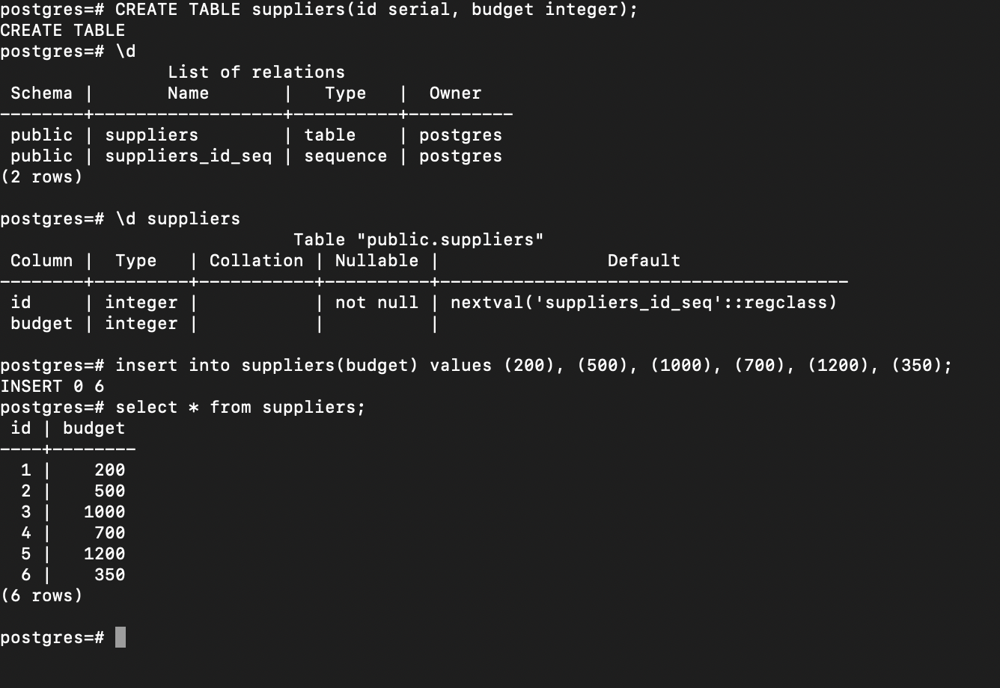
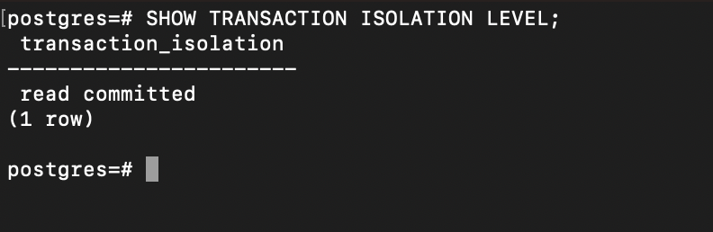
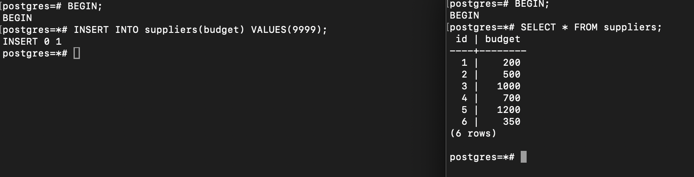
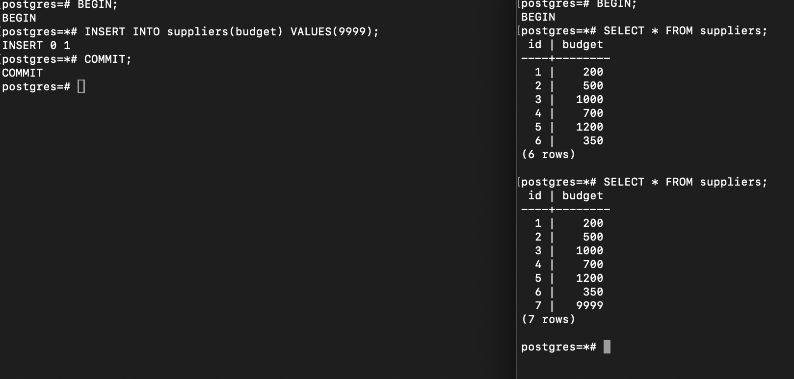
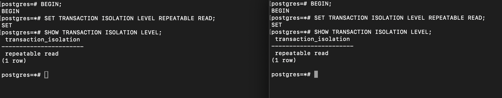
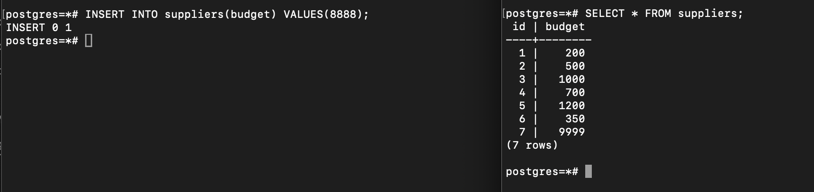
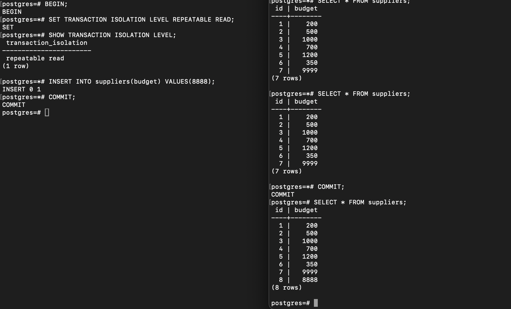

#### Открыть консоль и зайти по ssh на ВМ в ЯО/любое другое подключение
#### Открыть вторую консоль и также зайти по ssh на ту же ВМ в WB cloud или ЯО
#### Запустить везде psql из под пользователя postgres к одному кластеру ПГ

#### Сделать в первой сессии новую таблицу и наполнить ее данными

#### Посмотреть текущий уровень изоляции

#### Начать новую транзакцию в обоех сессиях с дефолтным (не меняя) уровнем изоляции
#### В первой сессии добавить новую запись
#### Сделать запрос на выбор всех записей во второй сессии
#### Видите ли вы новую запись и если да то почему?:
#### Текущий уровень изоляции read committed. Поскольку в первый сессии транзакция не была закоммиченна, вторая сессия не увидит внесенные изменения.

#### Завершить транзакцию в первом окне
#### Сделать запрос на выбор всех записей второй сессии
#### Видите ли вы новую запись и если да то почему?:
#### Новая запись стала видна, поскольку мы получили коммит от первой сессии

#### Начать новые транзакции, но уже на уровне repeatable read в ОБЕИХ сессиях

#### В первой сессии добавить новую запись
#### Сделать запрос на выбор всех записей во второй сессии
#### Видите ли вы новую запись и если да то почему?:
#### Нет. При repeatable read я не увижу внесенных изменений с первой сессии во второй, пока не будет получен коммит с обеих сессий

#### Завершить транзакцию в первом окне
#### Сделать запрос во выбор всех записей второй сессии
#### Видите ли вы новую запись и если да то почему?:
#### Нет. При repeatable read я не увижу внесенных изменений с первой сессии во второй, пока не будет получен коммит с обеих сессий
#### Однако, если закоммититься во второй сессии и повторно выполнить запрос, то будут видны изменения
