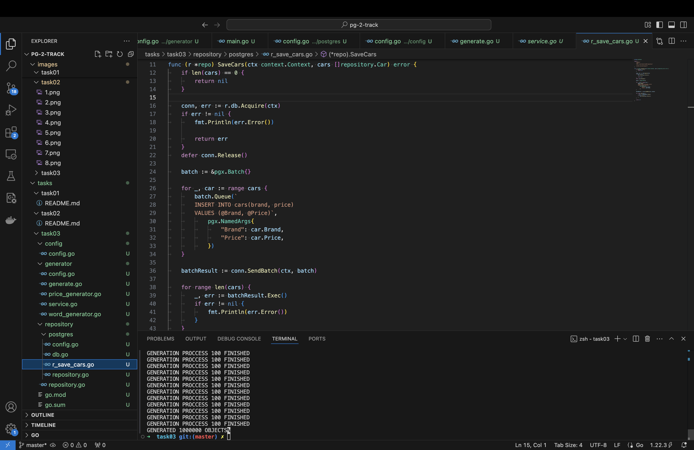
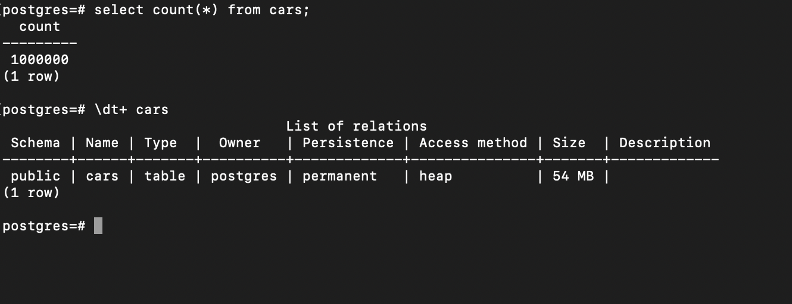
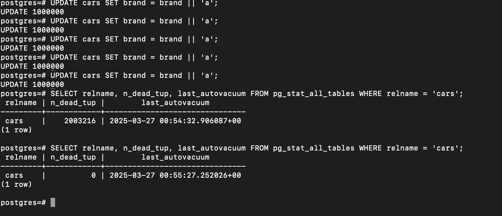
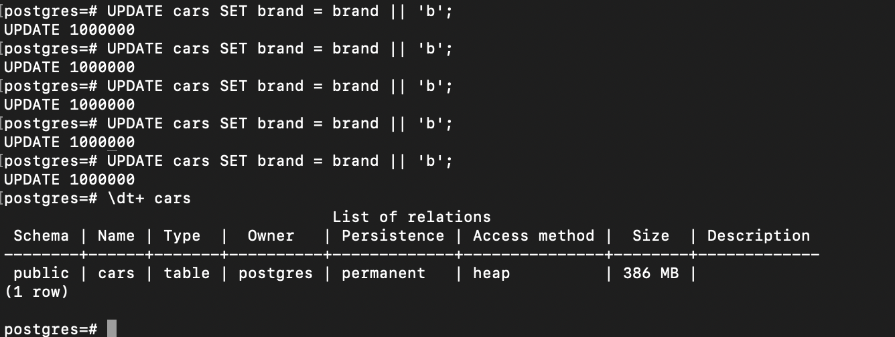
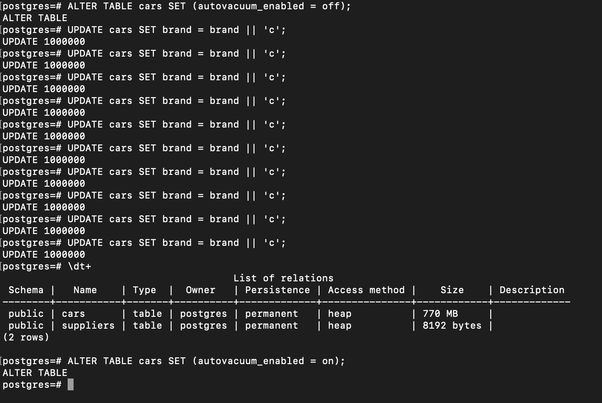

#### Создать таблицу с текстовым полем и заполнить случайными или сгенерированными данным в размере 1 млн строк:
CREATE TABLE IF NOT EXISTS cars(
    id SERIAL PRIMARY KEY,
    brand TEXT,
    price BIGINT
);

#### Посмотреть размер файла с таблицей:

#### 5 раз обновить все строчки и добавить к каждой строчке любой символ
#### Посмотреть количество мертвых строчек в таблице и когда последний раз приходил автовакуум
#### Подождать некоторое время, проверяя, пришел ли автовакуум:

#### 5 раз обновить все строчки и добавить к каждой строчке любой символ
#### Посмотреть размер файла с таблицей:

#### Отключить Автовакуум на конкретной таблице
#### 10 раз обновить все строчки и добавить к каждой строчке любой символ
#### Посмотреть размер файла с таблицей
#### Не забудьте включить автовакуум:

#### Объясните полученный результат:
При обновлении строк PG на самом деле создает новую строку, а старую отмечает как мертвую.
Процесс VACUUM физически не удаляет мертвые строки, он помечает их как доступные для повторного использования.
Из-за этого занимаемое место увеличивается. Для физической очистки от мертвых строк есть VACUUM FULL.