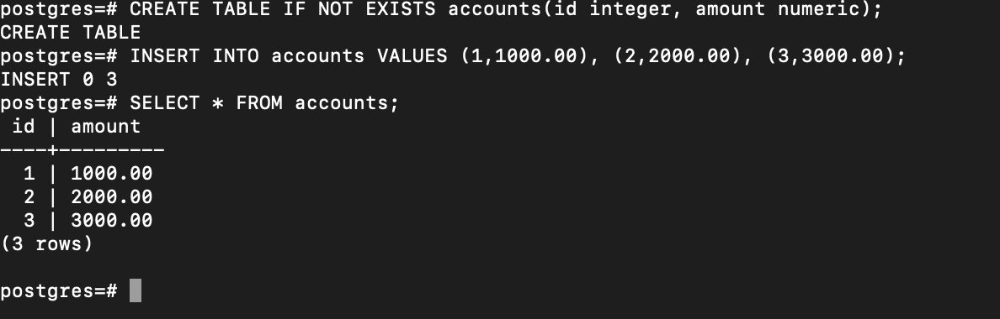
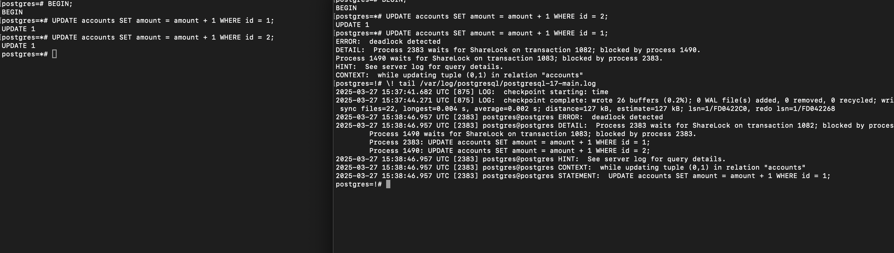

#### Создать таблицу accounts(id integer, amount numeric);

#### Добавить несколько записей и подключившись через 2 терминала добиться ситуации взаимоблокировки (deadlock).
#### Посмотреть логи и убедиться, что информация о дедлоке туда попала.
