### Протестировать падение производителности при исползовании pgbouncer в разных режимах: statement, transaction, session:
##### statement:
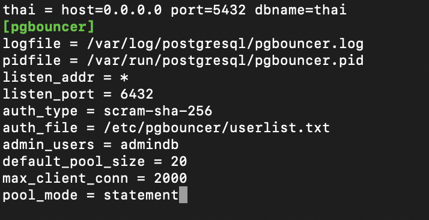
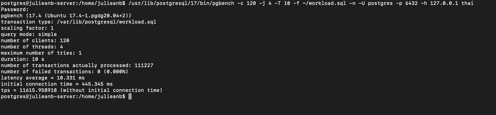
##### transaction:
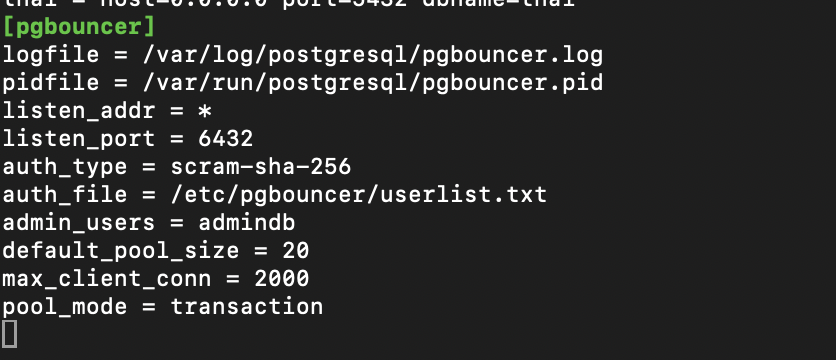
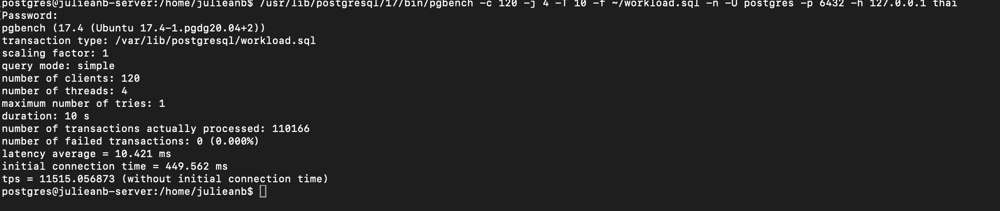
##### session:
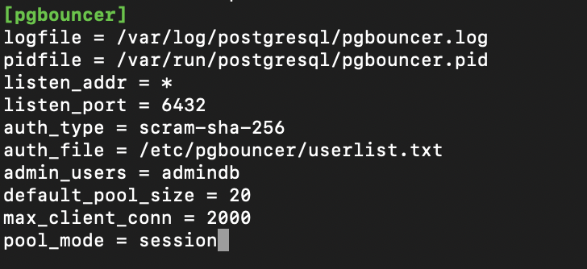
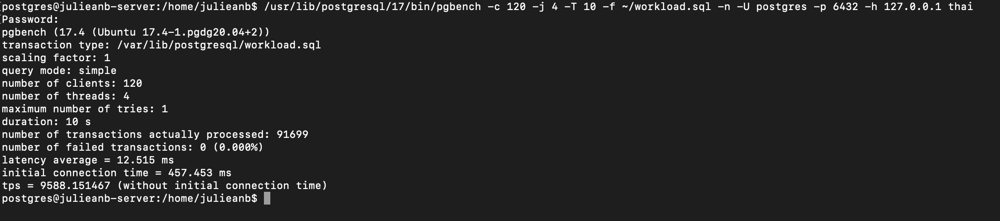
#### Итог:
#### statement - наиболее агрессивный режим, вернет соединение в пул, как только будет обработан первый запрос
#### transaction - удерживает соединение на момент выполнения транзакции, наблюдается небольшой упадок в производительности, поскольку в тесте транзакции короткие
#### session - наименее агрессивный режим, соединение удерживается для всей сессии клиента, значительный упадок в производительности, в сравнении со statement

### Предварительная работа по лекции:
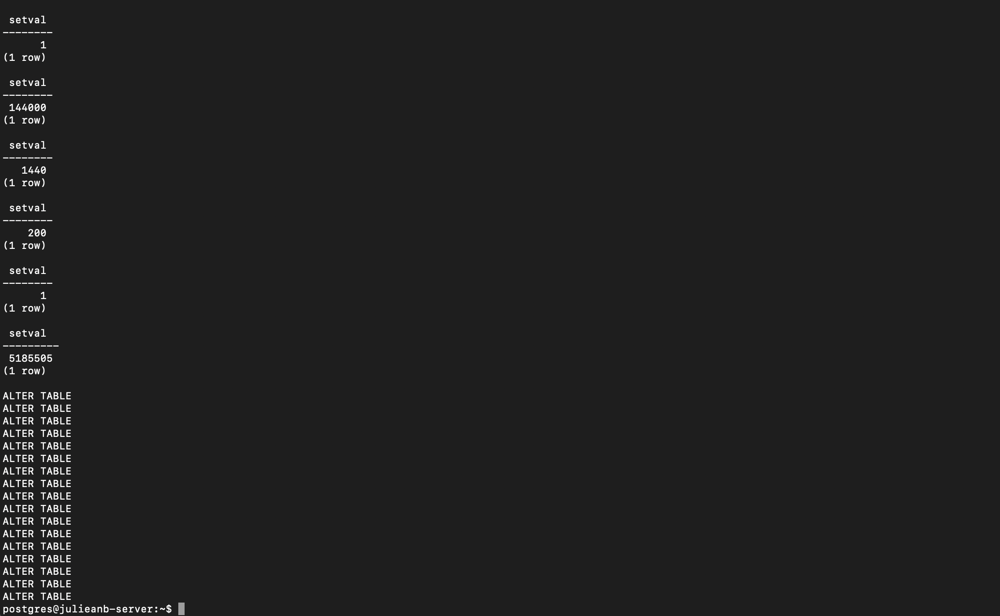
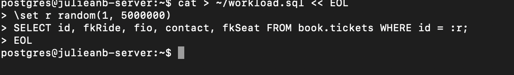
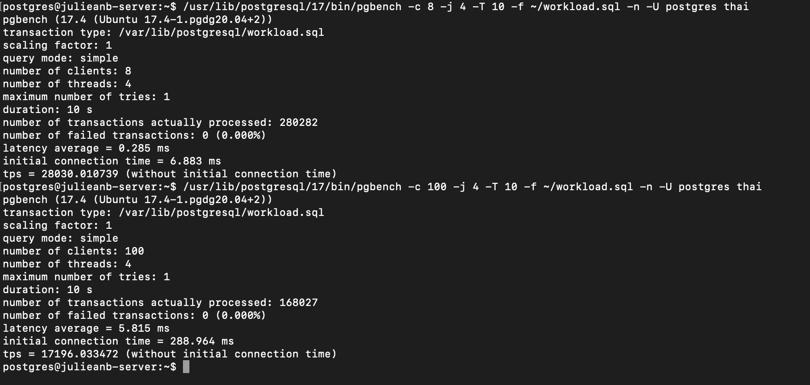
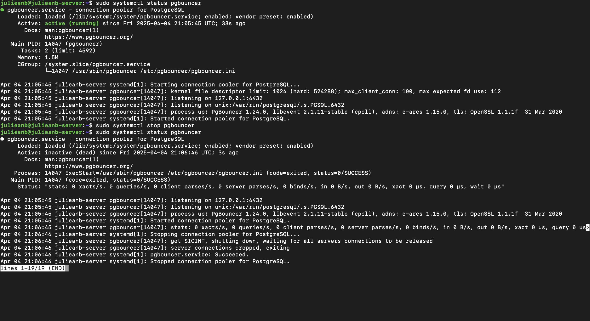
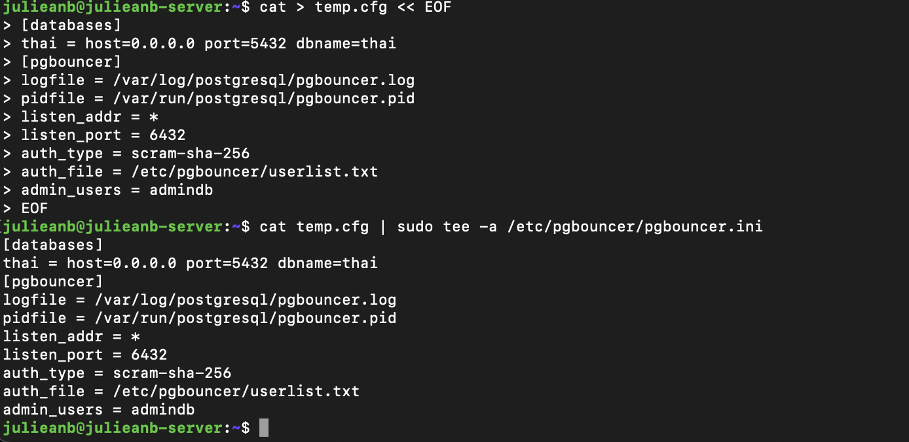
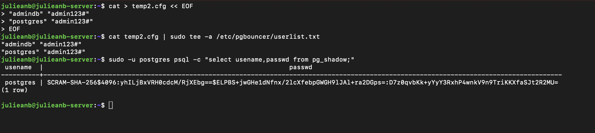
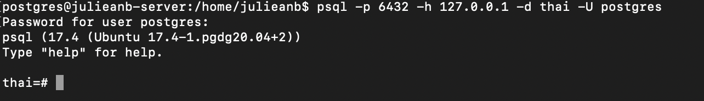
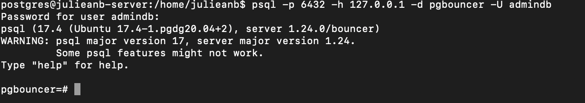
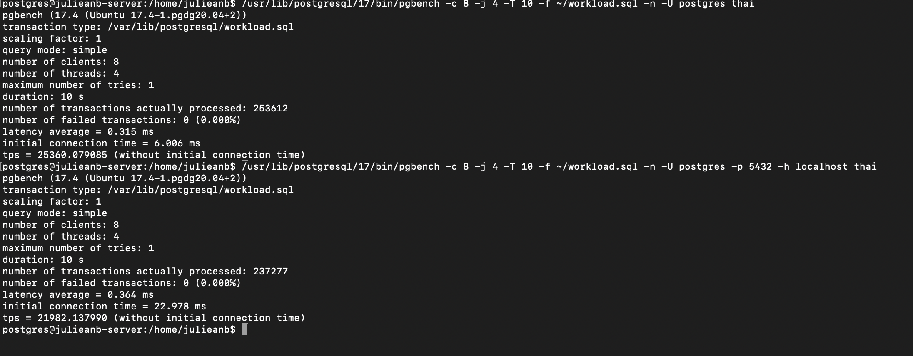
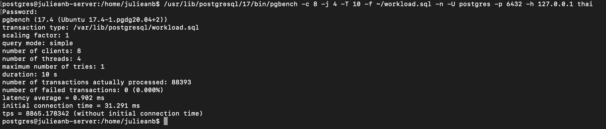
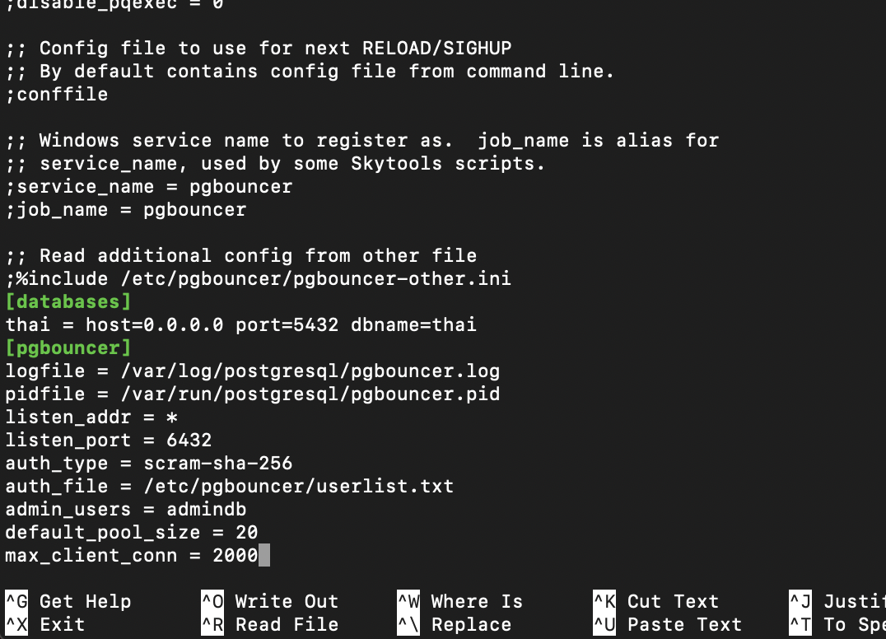
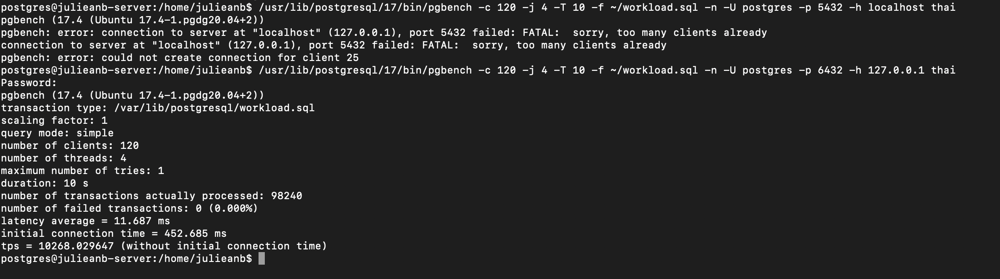